# Launch Kit 🚀

**Launch your future with AI-powered college and career tools.**

Launch Kit is a comprehensive suite of AI-powered tools designed to help high school and college students navigate their academic and professional journeys. The platform combines intelligent college search capabilities with automated networking and outreach tools.

## 🏗️ Complete System Architecture

```mermaid
graph TB
    subgraph "🚀 Launch Kit - Complete Project Architecture"
        
        subgraph "👤 User Interface Layer"
            UI1["🌐 Next.js Web Application<br/>Port: 3000"]
            UI2["📝 Curation Tab<br/>• Upload Resume & LinkedIn<br/>• Add Target URLs<br/>• Select Personalizations<br/>• Review & Edit Emails"]
            UI3["📊 Tracking Tab<br/>• Monitor Sent Emails<br/>• View Responses<br/>• Analytics Dashboard<br/>• Success Metrics"]
            UI4["⚙️ Settings Tab<br/>• Profile Management<br/>• Email Templates<br/>• Integration Settings<br/>• Preferences"]
            UI5["🎓 College Search<br/>• Natural Language Queries<br/>• Smart Recommendations<br/>• Filter & Compare<br/>• Save Favorites"]
            
            UI1 --> UI2
            UI1 --> UI3
            UI1 --> UI4
            UI1 --> UI5
        end
        
        subgraph "🔄 Workflow Orchestration - n8n"
            N8N1["📧 Email Generation Workflow<br/>• Profile Processing Pipeline<br/>• Personalization Engine<br/>• Quality Assurance<br/>• Batch Processing"]
            N8N2["📊 Tracking Workflow<br/>• Email Status Updates<br/>• Response Detection<br/>• Analytics Collection<br/>• Learning Data Prep"]
            N8N3["🔍 Profile Processing Workflow<br/>• LinkedIn Data Extraction<br/>• Company Research<br/>• Connection Mapping<br/>• Data Validation"]
            
            N8N1 <--> N8N2
            N8N1 <--> N8N3
        end
        
        subgraph "🤖 A2A AI Agents Ecosystem"
            subgraph "📊 Analysis Agents"
                A1["🔍 Profile Analysis Agent<br/>• LinkedIn Profile Parsing<br/>• Skill Extraction<br/>• Experience Analysis<br/>• Activity Monitoring<br/>Input: LinkedIn URLs<br/>Output: Structured Profile Data"]
                A2["👤 User Context Agent<br/>• Resume PDF Processing<br/>• Background Analysis<br/>• Expertise Mapping<br/>• Goal Identification<br/>Input: Resume, LinkedIn<br/>Output: User Profile Context"]
                A3["🏢 Company Research Agent<br/>• Company Intelligence<br/>• Recent News & Updates<br/>• Culture Analysis<br/>• Industry Insights<br/>Input: Company Names<br/>Output: Company Intelligence"]
            end
            
            subgraph "�� Intelligence Agents"
                A4["🔗 Connection Mapping Agent<br/>• Find Common Ground<br/>• Shared Experiences<br/>• Mutual Connections<br/>• Interest Overlaps<br/>Input: User + Target Profiles<br/>Output: Connection Points"]
                A5["✍️ Email Composition Agent<br/>• Personalized Content<br/>• Subject Line Generation<br/>• Tone Adaptation<br/>• Template Selection<br/>Input: All Profile Data<br/>Output: Draft Emails"]
                A6["✅ Quality Assurance Agent<br/>• Content Review<br/>• Personalization Check<br/>• Spam Score Analysis<br/>• Tone Validation<br/>Input: Draft Emails<br/>Output: Quality Scores"]
            end
            
            subgraph "🎯 Learning & Optimization"
                A7["🧠 Learning AI Agent<br/>• Performance Analysis<br/>• Pattern Recognition<br/>• Success Prediction<br/>• Recommendation Engine<br/>Input: Interaction Data<br/>Output: Optimization Insights"]
                A8["📈 Campaign Management Agent<br/>• Send Queue Management<br/>• Timing Optimization<br/>• Follow-up Scheduling<br/>• Response Tracking<br/>Input: Email Campaigns<br/>Output: Campaign Analytics"]
            end
        end
        
        subgraph "🗄️ Data Storage Layer"
            subgraph "📊 Supabase Infrastructure"
                DB1["👥 User Profiles Table<br/>• Authentication Data<br/>• LinkedIn URLs<br/>• Resume References<br/>• Preferences & Settings"]
                DB2["📇 Contact Profiles Table<br/>• LinkedIn Profile Cache<br/>• Company Information<br/>• Last Scraped Timestamps<br/>• Profile Embeddings"]
                DB3["📧 Email Campaigns Table<br/>• Campaign Metadata<br/>• Target Lists<br/>• Status Tracking<br/>• Generated Content"]
                DB4["📈 Email Interactions Table<br/>• Send Events<br/>• Open Tracking<br/>• Response Data<br/>• Learning Metrics"]
                DB5["🧠 Learning Patterns Table<br/>• Success Patterns<br/>• Optimization Rules<br/>• A/B Test Results<br/>• Performance Insights"]
                
                ST1["📁 Supabase Storage<br/>• user-resumes/<br/>• profile-cache/<br/>• email-assets/<br/>• learning-models/"]
            end
            
            subgraph "🔥 College AI - Firestore"
                FS1["🎓 Colleges Collection<br/>• College Metadata<br/>• Descriptions & Details<br/>• Vector Embeddings<br/>• Search Indices"]
                FS2["📊 College Analytics<br/>• Search Queries<br/>• User Preferences<br/>• Recommendation Data<br/>• Usage Statistics"]
            end
        end
        
        subgraph "�� External Integrations"
            EXT1["💼 LinkedIn API<br/>• Profile Data Extraction<br/>• Company Information<br/>• Connection Data<br/>• Activity Updates"]
            EXT2["📧 Email Services<br/>• Gmail API<br/>• Outlook API<br/>• SendGrid<br/>• Email Tracking"]
            EXT3["🤖 AI Language Models<br/>• OpenAI GPT-4<br/>• Anthropic Claude<br/>• Google Gemini<br/>• Embedding Models"]
            EXT4["🎓 College Data API<br/>• Federal College Data<br/>• Institution Information<br/>• Program Details<br/>• Statistics"]
        end
        
        subgraph "🏗️ College AI Module"
            CA1["📊 Data Fetcher<br/>fetch_colleges.py<br/>• API Integration<br/>• Data Validation<br/>• Batch Processing<br/>• Error Handling"]
            CA2["🧮 Embedding Generator<br/>generate_embeddings.py<br/>• Text Processing<br/>• Vector Creation<br/>• Batch Embedding<br/>• Index Updates"]
            CA3["🔍 Search Engine<br/>search_colleges.py<br/>• Query Processing<br/>• Semantic Search<br/>• Result Ranking<br/>• Response Generation"]
            CA4["☁️ Firestore Uploader<br/>upload_to_firestore.py<br/>• Data Sync<br/>• Document Updates<br/>• Batch Operations<br/>• Version Control"]
        end
        
        subgraph "📁 Project File Structure"
            PS1["📂 launch-kit/<br/>├── README.md<br/>├── .gitignore<br/>├── package.json"]
            PS2["📂 college-ai/<br/>├── src/ (Python files)<br/>├── data/ (CSV data)<br/>└── requirements.txt"]
            PS3["📂 email-outreach/<br/>├── frontend/ (Next.js)<br/>├── agents/ (A2A agents)<br/>├── workflows/ (n8n)<br/>└── database/ (Schemas)"]
            PS4["📂 shared/<br/>├── types/ (TypeScript)<br/>├── utils/ (Common functions)<br/>└── constants/ (Config)"]
        end
    end
    
    subgraph "🔄 Data Flow & Interactions"
        DF1["📥 User Input Flow<br/>Resume Upload → Profile Setup → Target Selection"]
        DF2["🔄 Processing Pipeline<br/>LinkedIn URLs → Profile Analysis → Company Research → Connection Mapping"]
        DF3["✍️ Email Generation Flow<br/>Profile Data → Personalization → Composition → Quality Check → User Review"]
        DF4["📤 Campaign Execution<br/>Email Approval → Send Queue → Delivery → Tracking → Learning"]
        DF5["🎓 College Search Flow<br/>User Query → Semantic Search → Results → Recommendations"]
    end
    
    %% User Interface Connections
    UI2 --> N8N1
    UI3 --> N8N2
    UI5 --> CA3
    
    %% n8n Workflow Connections
    N8N1 --> A1
    N8N1 --> A2
    N8N1 --> A3
    N8N3 --> A1
    N8N3 --> A3
    N8N2 --> A7
    N8N2 --> A8
    
    %% Agent Interactions (A2A Protocol)
    A1 --> A4
    A2 --> A4
    A3 --> A4
    A4 --> A5
    A5 --> A6
    A6 --> UI2
    A7 --> A5
    A8 --> EXT2
    
    %% Database Connections
    A1 --> DB2
    A2 --> DB1
    A5 --> DB3
    A8 --> DB4
    A7 --> DB5
    A2 --> ST1
    
    %% College AI Connections
    CA1 --> FS1
    CA2 --> FS1
    CA3 --> FS1
    CA4 --> FS1
    CA1 --> EXT4
    CA2 --> EXT3
    CA3 --> EXT3
    
    %% External API Connections
    A1 <--> EXT1
    A3 <--> EXT1
    A5 <--> EXT3
    A6 <--> EXT3
    A7 <--> EXT3
    A8 <--> EXT2
    
    %% Storage Connections
    DB1 <--> UI1
    DB2 <--> UI1
    DB3 <--> UI1
    DB4 <--> UI3
    ST1 <--> UI1
    FS1 <--> UI5
    
    %% Data Flow Connections
    DF1 --> DF2
    DF2 --> DF3
    DF3 --> DF4
    DF5 --> UI5
```



## 🎯 Features

### College AI Module
- **Smart College Search**: AI-powered semantic search across thousands of colleges
- **Personalized Recommendations**: Tailored college suggestions based on student preferences
- **Real-time Data**: Up-to-date college information from official sources
- **Natural Language Queries**: Search using conversational language

### Email Outreach Module
- **Automated Networking**: AI-generated personalized outreach emails
- **LinkedIn Integration**: Extract and analyze professional profiles
- **Smart Personalization**: Find meaningful connections between sender and recipient
- **Campaign Management**: Track email performance and responses
- **Learning AI**: Continuously improves email effectiveness based on user data

## 🏗️ Tech Stack

### Frontend
- **Next.js 14** - React framework with App Router
- **TypeScript** - Type-safe development
- **Tailwind CSS** - Utility-first styling
- **Supabase Auth** - User authentication

### Backend & Database
- **Supabase** - PostgreSQL database with real-time capabilities
- **Supabase Storage** - File storage for resumes and assets
- **Google Firestore** - College data storage (existing)
- **n8n** - Workflow automation and agent orchestration

### AI & Agents
- **Google Cloud A2A Protocol** - Agent-to-agent communication
- **OpenAI GPT-4** / **Anthropic Claude** - Language models
- **LangChain** - AI application framework
- **Vector Embeddings** - Semantic search capabilities

### Infrastructure
- **Vercel** - Frontend hosting
- **Google Cloud Run** - A2A agent hosting
- **Google Cloud Functions** - Serverless functions

## 📁 Project Structure

```
launch-kit/
├── README.md
├── .gitignore
├── package.json
├── 
├── college-ai/                 # College AI Module
│   ├── src/
│   │   ├── fetch_colleges.py
│   │   ├── generate_embeddings.py
│   │   ├── search_colleges.py
│   │   └── upload_to_firestore.py
│   └── data/
│       └── college_test_data.csv
│
├── email-outreach/             # Email Outreach Module
│   ├── frontend/               # Next.js Web Application
│   │   ├── app/
│   │   ├── components/
│   │   ├── lib/
│   │   └── public/
│   │
│   ├── agents/                 # A2A AI Agents
│   │   ├── profile-analysis/
│   │   ├── user-context/
│   │   ├── company-research/
│   │   ├── connection-mapping/
│   │   ├── email-composition/
│   │   ├── quality-assurance/
│   │   └── learning-ai/
│   │
│   ├── workflows/              # n8n Workflows
│   │   ├── email-generation.json
│   │   ├── profile-processing.json
│   │   └── tracking-updates.json
│   │
│   └── database/               # Database Schemas & Migrations
│       ├── supabase/
│       └── migrations/
│
└── shared/                     # Shared Utilities
    ├── types/
    ├── utils/
    └── constants/
```

## 🚀 Getting Started

### Prerequisites
- Node.js 18+ 
- Python 3.9+
- Supabase account
- Google Cloud Platform account
- OpenAI/Anthropic API keys

### Installation

1. **Clone the repository:**
   ```bash
   git clone https://github.com/bshihab/launch-kit.git
   cd launch-kit
   ```

2. **Install dependencies:**
   ```bash
   # Frontend dependencies
   cd email-outreach/frontend
   npm install
   
   # Python dependencies for College AI
   cd ../../college-ai
   pip install -r requirements.txt
   ```

3. **Environment Setup:**
   ```bash
   # Copy environment template
   cp .env.example .env
   
   # Add your API keys and configuration
   ```

4. **Database Setup:**
   ```bash
   # Run Supabase migrations
   npx supabase db reset
   ```

5. **Start Development:**
   ```bash
   # Start frontend
   cd email-outreach/frontend
   npm run dev
   
   # Start n8n (in another terminal)
   npx n8n start
   ```

## 📖 Module Documentation

### College AI Module

The College AI module provides intelligent college search and recommendation capabilities:

- **Data Pipeline**: Automated fetching and processing of college data
- **Semantic Search**: Vector-based search using OpenAI embeddings
- **Natural Language Interface**: Query colleges using conversational language

**Usage:**
```bash
# Fetch latest college data
python college-ai/src/fetch_colleges.py

# Generate embeddings
python college-ai/src/generate_embeddings.py

# Interactive search
python college-ai/src/search_colleges.py
```

### Email Outreach Module

The Email Outreach module automates professional networking through AI-generated personalized emails:

**Key Features:**
- Upload resume and LinkedIn profile
- Bulk LinkedIn URL processing
- AI-powered email personalization
- Response tracking and analytics
- Continuous learning from user interactions

**User Flow:**
1. **Setup**: Upload resume and LinkedIn profile
2. **Import**: Add target LinkedIn URLs
3. **Process**: AI analyzes all profiles and finds connections
4. **Personalize**: Select personalization options
5. **Generate**: AI creates tailored emails
6. **Review**: Edit and approve emails
7. **Send**: Bulk send with tracking
8. **Track**: Monitor responses and engagement

## 🤝 Contributing

We welcome contributions! Please see our [Contributing Guidelines](CONTRIBUTING.md) for details.

## 📄 License

This project is licensed under the MIT License - see the [LICENSE](LICENSE) file for details.

## 🙋‍♂️ Support

For questions and support:
- Create an [Issue](https://github.com/bshihab/launch-kit/issues)
- Join our [Discord Community](https://discord.gg/launch-kit)
- Email: support@launch-kit.dev

---

**Built with ❤️ for students, by students.**
